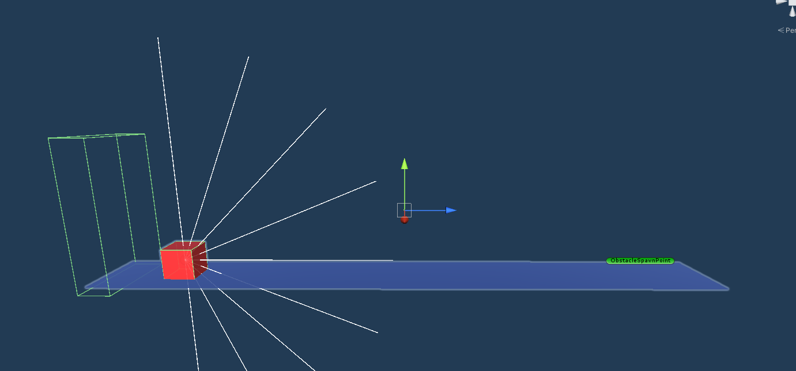
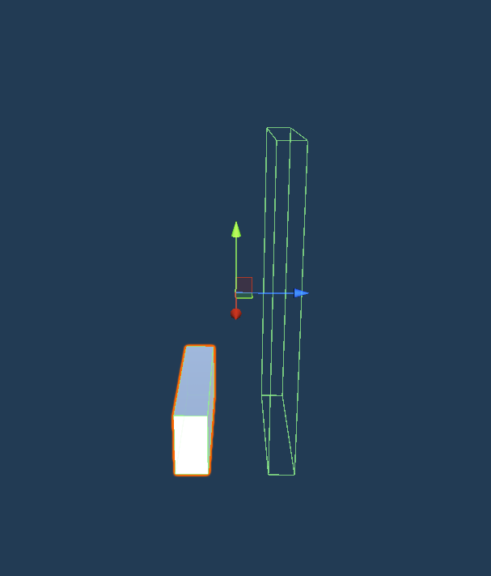
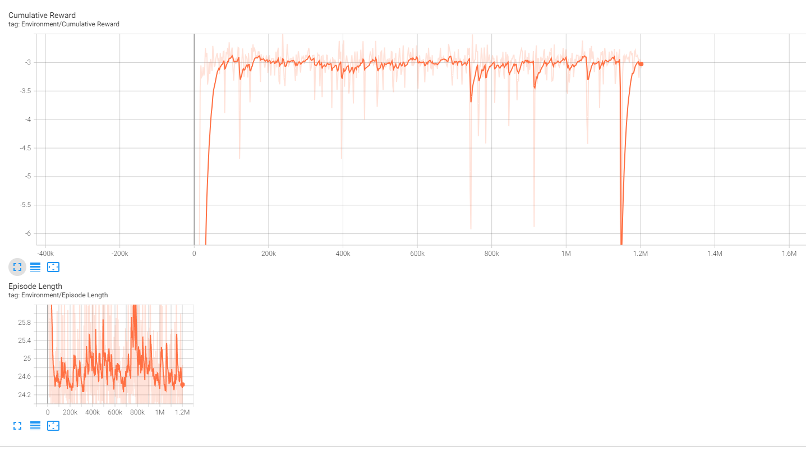

# Jumper ML-Agents oefening
## Inleiding

In de ML-Agent 'Jumper' uitdaging wordt een kubus uitgedaagd om over muren (balken) te springen en mogelijk ook enkele bollen (spheres) te verzamelen voor extra punten. Het bestraffen van onnodig springen gebeurt door een kleine aftrek van punten, terwijl stilstaan juist beloond wordt met een kleine toevoeging van punten. Het hoofddoel is om de kubus zo lang mogelijk punten te laten vergaren zonder tegen een muur aan te botsen. Zodra de kubus een muur raakt, wordt de huidige training afgesloten. Het vermijden van elk contact met muren is dus van essentieel belang.

Om dit project na te maken volg je de volgende stappen:

1. Maak een jumper omgeving waar je een platform hebt met daar op een agent. aan de ander kant van het platform zet je een empty game object, hier gaan de obstacels uit spawnen.

3. Hierna gaan we het obstacel prefab maken. Deze bevat een obstacel en een extra rechthoek er achter dat als reward dient.

5. Zorg dan dat je de volgende code in de juiste obejcten steekt:
- Agent:
```cs
public float jumpMultiplier = 1.5f;
    public Transform reset = null;
    private Rigidbody rb = null;
    public Transform obstacle = null;
    
    public override void Initialize()
    {
        rb = this.GetComponent<Rigidbody>();
        rb.constraints = RigidbodyConstraints.FreezeRotation;
    }
    public override void OnEpisodeBegin()
    {
        Debug.Log("Reset");
        ResetMyAgent();
    }
    public override void CollectObservations(VectorSensor sensor)
    {
    }

    public override void OnActionReceived(ActionBuffers actions)
    {
        // Movement
        int action = actions.DiscreteActions[0];

        if (action == 1 && IsGrounded())
        {
            Debug.Log("Jumped");
            Rigidbody rigidbody = GetComponent<Rigidbody>();
            Vector3 velocity = rigidbody.velocity;

            velocity.y += jumpMultiplier;
            rigidbody.velocity = velocity;
            AddReward(-1f);
        }
    }

    private void ResetMyAgent()
    {
        this.transform.position = new Vector3(reset.position.x, reset.position.y, reset.position.z);
    }

    public override void Heuristic(in ActionBuffers actionsOut)
    {
        var discreteActionsOut = actionsOut.DiscreteActions;
        discreteActionsOut[0] = Input.GetKey(KeyCode.Space) ? 1 : 0;
    }


    public bool IsGrounded()
    {
        Debug.Log("Touching ground");
        RaycastHit hit;
        float rayLength = 1f; // Adjust based on your character's size
        int groundLayerMask = 1 << LayerMask.NameToLayer("Ground");

        if (Physics.Raycast(transform.position, Vector3.down, out hit, rayLength, groundLayerMask))
        {
            return true;
        }
        return false;
    }
    void OnCollisionEnter(Collision collision)
    {
        if (collision.gameObject.CompareTag("obstacle"))
        {
            Debug.Log("Hit obstacle");
            AddReward(-3f);
            EndEpisode();
        }

    }

    void OnTriggerEnter(Collider other)
    {
        if (other.gameObject.CompareTag("wallReward"))
        {
            Debug.Log("Hit reward");
            AddReward(5f);
        }
    }
```
- Spawner:
```cs
    public GameObject prefab = null;
    public Transform spawn = null;
    public float minTime = 1.0f;
    public float maxTime = 3.0f;
    public float spawnInterval = 1.0f; // Interval between spawns

    private void Start()
    {
        // Start spawning obstacles immediately
        InvokeRepeating("SpawnObstacle", Random.Range(minTime, maxTime), spawnInterval);
    }

    private void SpawnObstacle()
    {
        GameObject go = Instantiate(prefab);
        go.transform.position = spawn.position;
        // Add the spawned obstacle to a list
        ObstacleManager.Instance.AddObstacle(go);
    }

    private void OnTriggerEnter(Collider other)
    {
        // Check if the collided object has the tag "agent" or "Finish"
        if (other.CompareTag("agent") || other.CompareTag("Finish"))
        {
            // Remove all spawned obstacles
            ObstacleManager.Instance.RemoveObstacles();
        }
    }
```
- obstacle:
```cs
    public float minMoveSpeed = 4.0f;
    public float maxMoveSpeed = 6.0f;
    private float moveSpeed;
    private Vector3 initialPosition;

    

    void Start()
    {
        // Generate a random move speed within the specified range
        moveSpeed = Random.Range(minMoveSpeed, maxMoveSpeed);

        // Store the initial position of the obstacle
        initialPosition = transform.position;
    }

    void Update()
    {
        // Move the obstacle backwards with the randomly generated move speed
        transform.Translate(Vector3.back * moveSpeed * Time.deltaTime);
    }

    void OnCollisionEnter(Collision collision)
    {
        Obstacle collidedObstacle = collision.gameObject.GetComponent<Obstacle>();
        if (collidedObstacle != null)
        {
            if (moveSpeed > collidedObstacle.moveSpeed)
            {
                Destroy(this.gameObject);
            }
            else
            {
                Destroy(collision.gameObject);
            }
        }
        // Check if the collided object has the tag "agent" or "Finish"
        if (collision.gameObject.CompareTag("agent") || collision.gameObject.CompareTag("Finish"))
        {
            Destroy(this.gameObject);
        }
    }
```

4. Zet dan al de parameters op de juiste waardes (Niet die van ons want de jumper doet niet wat hij moet doen en lijkt behoorlijk dom)
5. begin hierna te testen met het volgende commando: mlagents-learn config/CubeAgent.yaml --run-id=Main
6. Wanneer dit klaar is kun je met dit commando: "tensorboard --logdir results" de resultaten zien in een grafiek. Hieronder is een voorbeeld van onze agent. Dit zou je niet mogen krijgen want deze agent is niet zo slim.


(Wij kregen het niet voor elkaar de agent correct jumpende te krijgen. We hebben heel wat verschillende code geprobeerd en niks bleek te werken. We hebben uiteindelijk de agent laten trainen met ongeveer 1mil aan steps. Dit loste het probleem ook niet op en dus bleef de agent "dom".)
